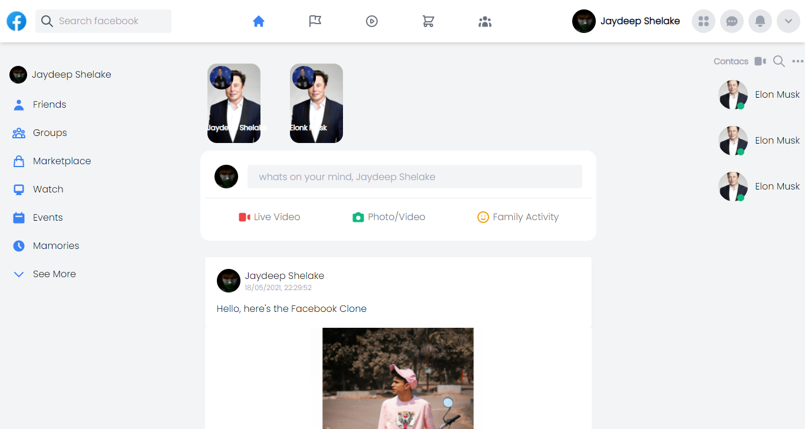

# FACEBOOK CLONE

  

 

> FACEBOOK CLONE USING REACT.JS ,REDUX & FIRBASE (UNDER DEVLOPEMENT)
> App made to brush up the NEXT.JS skills 

## ⚙️ Detailed Functionality
* Users have to authenticate themselves by Facebook Auth
* Login Users can Read,Creat,Update and Delete there Posts
* Users can also create thier own stories and can comment on others posts
* User can view their profile and other user's too
* User can logout any time from the app

 
## 🚀 Tech and Tools Used

* Next.JS ,Tailwind CSS ,Next Auth, Firebase ,Firebase Hooks....
* VS code
* Heroicons

## 📸 Screenshots

## Home Page

